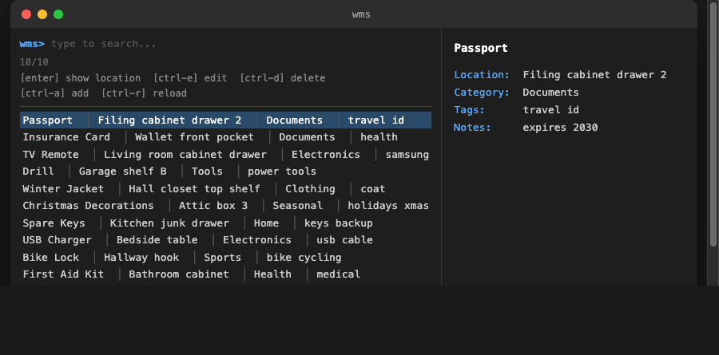

# wms - Where's My Stuff

A fast terminal tool for tracking where physical items are stored. Type a few letters, find your stuff.




## Why

You put your passport somewhere safe. Now you can't find it. `wms` solves this by giving you a searchable inventory from the terminal in seconds.

## Features

- **Interactive fuzzy search** - powered by [fzf](https://github.com/junegunn/fzf), search across all fields at once
- **Inline editing and deletion** - edit (`ctrl-e`) or delete (`ctrl-d`) items directly from the search view
- **Non-interactive search** - `wms find` for scripts and quick lookups
- **Plain text storage** - data lives in a simple TSV file you can open in any text editor or spreadsheet
- **Zero config** - no database, no server, no setup beyond installing two tools

## Requirements

- [zsh](https://www.zsh.org/)
- [fzf](https://github.com/junegunn/fzf)

Works on macOS and Linux.

## Install

```sh
# Clone the repo
git clone https://github.com/guyguy2/wheresMyStuff.git
cd wheresMyStuff

# Symlink to your PATH
./wms install
```

This creates a symlink at `~/.local/bin/wms`. Make sure `~/.local/bin` is in your `PATH`:

```sh
export PATH="$HOME/.local/bin:$PATH"
```

## Usage

### Interactive search (default)

```sh
wms
```

Opens fzf with all your items. Type to filter across name, location, category, tags, and notes. Press `enter` to print the selected item's location.

**Keys in search view:**

| Key | Action |
|---|---|
| `enter` | Print item location |
| `ctrl-e` | Edit selected item |
| `ctrl-a` | Add a new item |
| `ctrl-d` | Delete selected item |
| `ctrl-r` | Reload list |

### Add an item

```sh
# With flags
wms add "TV Remote" -l "Living room cabinet" -c "Electronics" -t "samsung"

# Interactive prompts
wms add
```

| Flag | Description |
|---|---|
| `-l, --location` | Where the item is stored |
| `-c, --category` | Grouping label (e.g. Documents, Tools) |
| `-t, --tags` | Space-separated keywords |
| `-n, --notes` | Freeform notes |

### Non-interactive search

```sh
wms find passport           # items containing "passport"
wms find filing cabinet     # items matching both "filing" AND "cabinet"
```

### List all items

```sh
wms ls
```

### Edit an item

```sh
wms edit
```

Opens fzf to pick an item, then prompts to edit each field with the current value pre-populated.

### Delete an item

```sh
wms rm
```

Opens fzf to pick an item, then asks for confirmation before deleting.

## Data storage

Items are stored as tab-separated values at:

```
~/.local/share/wms/items.tsv
```

Each item has five fields: `name`, `location`, `category`, `tags`, `notes`. The file is human-readable and can be edited directly with any text editor or imported into a spreadsheet.

Before any edit or delete, `wms` saves a backup to `items.tsv.bak` in the same directory.

## Command reference

| Command | Alias | Description |
|---|---|---|
| `wms` | `wms search`, `wms s` | Interactive fzf search |
| `wms add` | | Add an item |
| `wms find` | `wms f` | Non-interactive keyword search |
| `wms ls` | `wms list` | List all items |
| `wms edit` | `wms e` | Pick and edit an item |
| `wms rm` | `wms remove` | Pick and delete an item |
| `wms install` | | Symlink to ~/.local/bin/wms |
| `wms version` | `wms -v`, `wms --version` | Print version |
| `wms help` | | Show help |

## License

MIT
